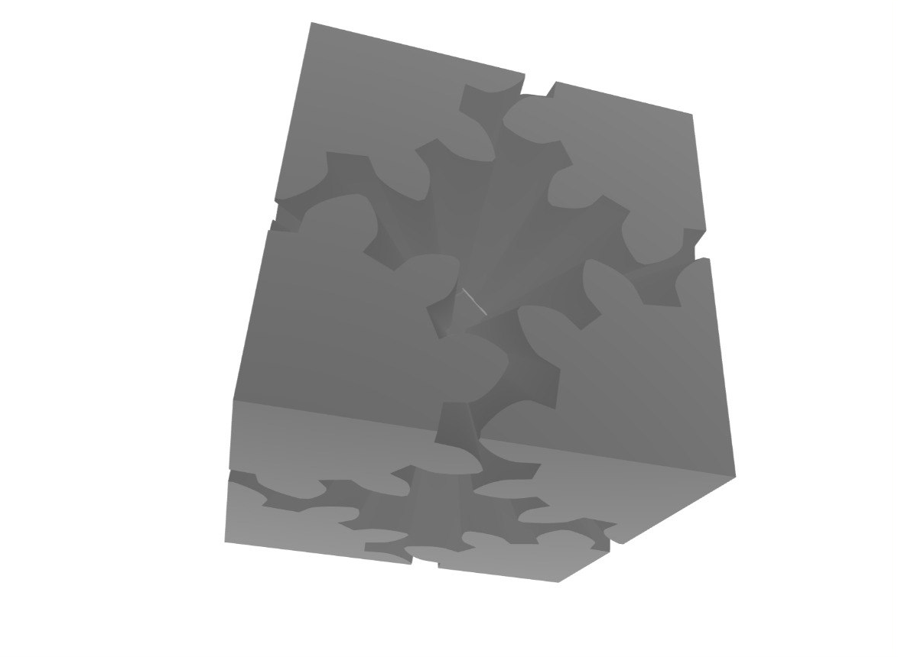
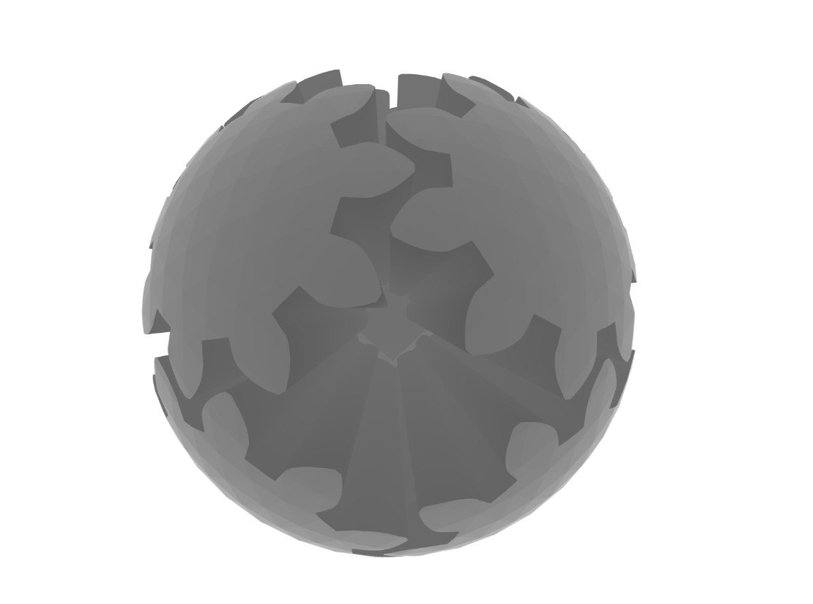
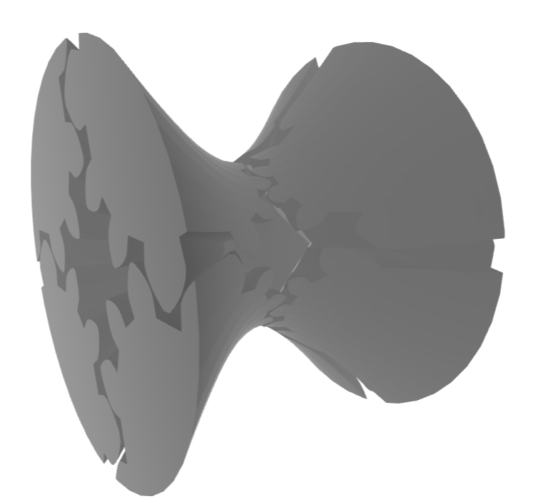
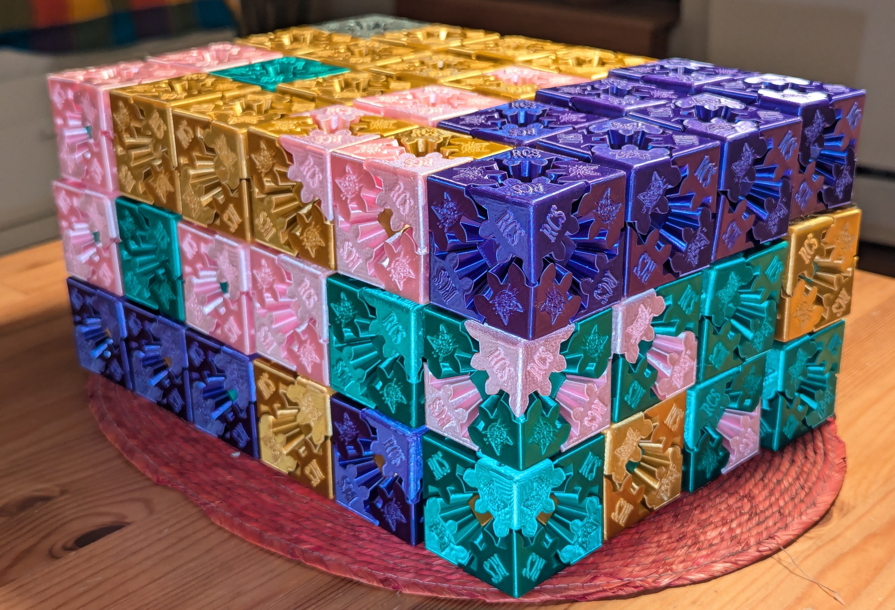

# Fidget

Create 3D-printable mechanical fidget toys of different shapes made of interconnected gears.

## What is this?

This is a minimalist tool for building mechanical fidget toys through functional geometry operations.

## What does it look like?







## Prints



A batch of colorful cubes.

## Why?

I got fascinated by this [Gear Ball](https://thangs.com/designer/RuvenBals/3d-model/Gear%20Ball-1069853) I saw at my friend's place in San Francisco. He was kind enough to give it to me and I promised to make a cube version of it.

After a bit of research I came across this beautiful [Gear Heart](https://www.thingiverse.com/thing:243278) that had a better version of pins.

I thought it would be a fun exercise to make my own version of it and share it with the family. You can turn it into any shape and share the joy with family and friends.

## Installation

1. Install uv (if you haven't already):

```sh
curl -LsSf https://astral.sh/uv/install.sh | sh
```

2. Create a virtual environment and install all dependencies (including dev):

```sh
uv venv --python 3.12
source .venv/bin/activate # On Windows use: .venv\Scripts\activate
uv sync --all-extras --dev
uv pip install jupyter
```

## Usage

```sh
uv run jupyter notebook
```

Check out the [example notebook](example.ipynb) to learn how to:
- Create a core structure with customizable diameter
- Generate gears with custom profiles and configurations
- Apply different shapes (cube, sphere) to your fidget toy
- Add connecting pins for assembly
- Export the parts for 3D printing


## Get In Touch

If you have any questions or feedback, send me an email at [artyom.astafurov@gmail.com](mailto:artyom.astafurov@gmail.com).
